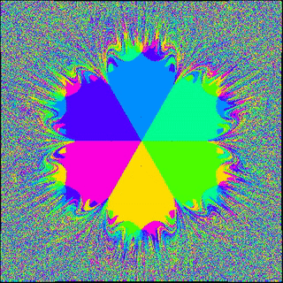

# Simple N Body Dynamics Simulation with CUDA

This is an attempt to simulate the following fascinating demonstration on youtube.

https://www.youtube.com/watch?v=C5Jkgvw-Z6E

We make good use of shared memeory, memeory coelescing, unified memeory with CUDA programming model.
The overall code is under 200 lines.

Compile the project with

```sh
nvcc -o main main.cu -I .. -lcuda $(pkg-config opencv4 --libs --cflags)
```

Run the software with good parameters.

```sh
./main x.avi 0.0001 0.0001 0.01
```

Paramters are `<video output path> <weight> <string tension> <drag> <n_body>`, respectively.

# Example Dynamic's Output:

N = 3


N = 5


N = 6



N = 16


